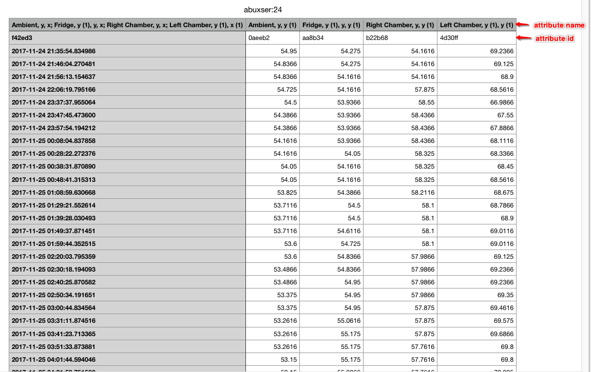
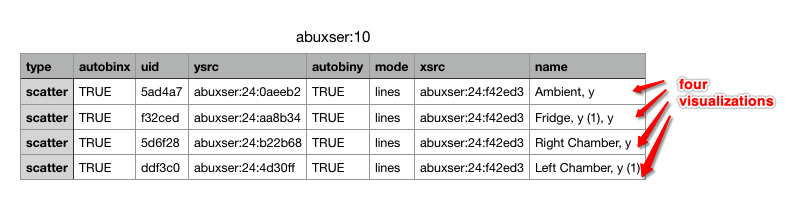

# Anonymous KDD '21 research paper submission

Repository for data release for KDD2021 submission "Learning to Recommend Visualizations from Data".

### Table of Contents

<!--ts-->
   * [Note](#note)
   * [Data](#Data)
<!--te-->

### Note

In this data release for anonymous review, we use this dedicated github account.
While github has a file limit of 100MB, it turns out to be a reasonable solution. 

Alternative solutions such as [anonymous.4open.science](anonymous.4open.science) cannot display contents for certain types of files. 

### Data

#### Directory Structure

The `data/1k` directory contains the data for RQ1 (Sec. 5.1) in the paper. It contains ~1k datasets and corresponding visualizations. 

The data curates from the [raw Plot.ly corpus](https://github.com/mitmedialab/vizml#accessing-data) led by the [VizML](https://vizml.media.mit.edu) research team. We curate by randomly sampling 1k datasets.

- `dataset/`: Each file is a `.csv` of one dataset.
- `vis/`: Each file is a `.csv` of all visualizations for one dataset that has the corresponding name in `dataset/`.
- `tmp/`: Several `.pkl` files for the implementation in Sec. 4, such as: 
    - `meta_variable_mapping.pkl`: A mapping file of attributes and their meta-features (Table 3). The file size is 95.9 MB.    
    - `wide-and-deep-used_variable_config_mapping_list.pkl`: a list file where each tuple is a visualization that decomposes into a vis. configuration and subsets of attributes used (Figure 1).
    - `wide-and-deep-config2id.pkl`: observed space of visualization configurations (Definition 2).
    - `wide-and-deep-dataset2id.pkl`: dictionary of datasets.
    - `wide-and-deep-variable2id.pkl`: dictionary of datasets.
- `vis_all.csv`: a joint file for all visualizations from `vis/`. Abstracting from those visualizations give us the observed space of visualization configurations (Definition 2).

Note that Sec. 5.1 reports to have 925 datasets. This amount comes after pre-processing. 

##### An example dataset file `abuxser/24.csv`.

##### An example file `abuxser/10.csv` of all visualizations for `abuxser/24.csv`.

 

### Contacts
Thanks for your review attention!

